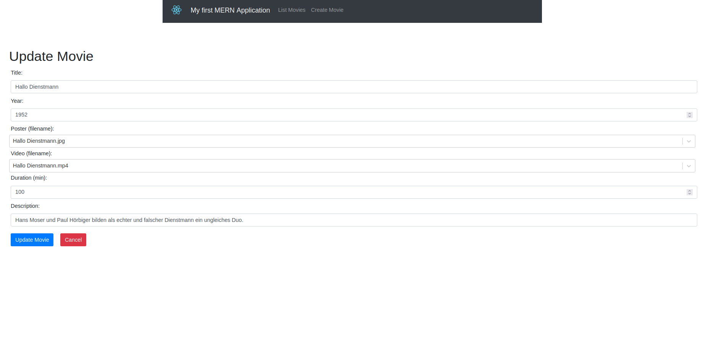

# Senior-Movie-Selector

| `client` | `db_client` list | `db_client` update | `db_client` create | `db_client` create(2) |
|----------|------------------|--------------------|--------------------|-----------------------|
|  |  |  |  |  |

## Summary

To run this project you'll need [docker compose](https://docs.docker.com/compose/), but you can skip the installation, if you use the Ansible role later on for an installation on a PI.

To fully use this project you have to do these three steps:

1. Prepare the project directory
2. Store your media files ([supported movie files](https://videojs.com/guides/faqs/#q-what-media-formats-does-videojs-support))
3. [Create a database entry for every movie](#db-client)

In the following section are multiple ways described how to start the project for different usecases.

After the installation you can check out the [Additional](#additional) section for further useful information

## Getting started

> **NOTE:** This project can also be used with a remote control. You can find more information [here](#information-about-using-a-remote)

### PI

To run this project on a Raspberry Pi use the [64-bit version](https://www.raspberrypi.com/software/operating-systems/#raspberry-pi-os-64-bit) on `raspi 3` or higher

For the installation and the whole setup you can use the Ansible role in the `./ansible` directory.

> **IMPORTANT:** Ansible runs on your pc, <u>not on your pi</u> and executes commands via an ssh connection. To use the role a [passwordless ssh connection](https://www.ssh.com/academy/ssh/copy-id) to the pi is necessary.

Once that is ensured, you can follow the steps below for installation and setup.

1. [Install Ansible](https://docs.ansible.com/ansible/latest/installation_guide/intro_installation.html) on your pc
2. Download the repository to your pc
3. Navigate to the `ansible` folder of the repository
4. Install the requirements with:

```sh
ansible-galaxy install -r requirements.yml
```

5. Customize the variables in the `vars/vars.yml` file to your liking
6. Start the role with:

```sh
ansible-playbook install.yml
```

### Other Operating Systems
> **Note:** If you want to use the application also after reboots you should restart it with `docker compose restart`

#### Opt 1: Official images

Create a `films`, `mongo/db` and `poster` folder or symlink in your project directory and place your [media files](https://videojs.com/guides/faqs/#q-what-media-formats-does-videojs-support). So it should look kinda like this:

```txt
senior-movie-selector/
├─ films/
│  ├─ film-1.mp4
│  ├─ film-2.mp4
│  ├─ ...
├─ mongo/db/
├─ poster/
│  ├─ poster-1.png
│  ├─ poster-2.png
│  ├─ ...
├─ docker-compose.yml
```

Download the `docker-compose.yml` and use this command to pull and start the containers:

```sh
docker compose up -d
```

#### Opt 2: Build own images

If you don't want to use the official images or if your platform is not supported (yet) you can also download the whole project, place your files in the `films` and `poster` directories (or replace the folders with symlinks) and then build and start the containers yourself with the following command:

```sh
docker compose -f docker-compose-prod.yml up -d
```

## Services

The application consists of 5 docker containers but only the [client](#client) and the [db-client](#db-client) have to be accessed manually in the browser.

### [db-client](http://localhost:8000)

> **NOTE:** You can find information to edit the database externally [here](#information-about-updating-the-database-externally)

This service runs on `localhost:8000` and can be used to insert or edit Movies in the DB after you placed the files of the movie in the `films` and `posters` folders.

Options:

- list movies
- create movie
- edit movie
- delete movie

### [client](http://localhost)

This is the main application and runs on `localhost`. After creating your database entries you can use this application to select and watch your movies.

Supported actions are:

- `ArrowUP`/`Escape`/`Backspace` -> create new random selection (reload)
- `ArrowRight`/ `ArrowLeft` -> select movies
- `Enter` -> start the selected movie
- `Hover` over a movie -> show information
- `Click` on a movie -> start the clicked movie

### [fileserver](http://localhost:1337)

This server runs on `localhost:1337` and is hosts static files for the other services like some CSS files, movies, posters and the HTML file that contains the `videoplayer`

#### Videoplayer

The `videoplayer` (main.html) takes a filename as a URL parameter and tries to open that file.
When clicking on a film in the `client` you get redirected to the `videoplayer`. The player then tries to open the `videofile` with the name from the db.
If the file is not found or if an error occurs you get redirected back to the `client`.
If the video file is found the `videoplayer` tries to start it automatically in \"full screen\" (technically just laaarge)

> **Notes:**
>
> - To start the video automatically in Firefox this has to be allowed manually at least once
> - Supported file types [depend on your browser](https://videojs.com/guides/faqs/#q-what-media-formats-does-videojs-support). Mp4 should work on all common browsers.

Supported actions are:

- `Click`/`Enter` -> start/stop
- `Backspace` -> return to `client`
- `ArrowRight`/`ArrowLeft` -> ±15 seconds (can be hold for longer periods)

### [db-server](http://localhost:3000)

This server runs on `localhost:3000` and hosts the `db-api` to make actions to the `mongo-db`

### [mongo](http://localhost:27017)

This database container runs on `localhost:27017` and is the actual database for the project that stores the data in the `mongo/db` folder

## Additional

### Information about using a remote

 Through the supported key-events a remote like [this one](https://www.amazon.de/Andoer%C2%AE-Magische-Drahtlose-Fernbedienung-PC-Projektor-Type-1/dp/B015SO37SY) can be used.
To make it even easier to use you can [disable](https://superuser.com/questions/775785/how-to-disable-a-keyboard-key-in-linux-ubuntu) all buttons you don't need. **But beware: these settings are systemwide**

### Information about updating the database externally

The project itself runs completely locally, but if the target computer is connected to a network, it is also possible to update the database or check the services from another computer that is in the same network, using ssh port forwarding. On Linux this can be done with this entry in your `~/.ssh/config`

```sh
Host pi-sms-fwd
	HostName <ip-of-your-pi>
	User <user>
	LocalForward 8000 127.0.0.1:8000
	LocalForward 3000 127.0.0.1:3000
	LocalForward 27017 127.0.0.1:27017
	LocalForward 8080 127.0.0.1:80
	LocalForward 1337 127.0.0.1:1337
```

and the corresponding command:

```sh
ssh pi-sms-fwd`
```

After that all services from the pi except the client can be accessed with the normal localhost URLs. The `client` can only be accessed via `localhost:8080` because port `80` can't be used for forwarding.

> **Note:**
> You _can_ also use this configuration to use the services externally with the pi as a server, but you should change the port of the `client` on the pi from 80 to 8080 first and also all `localhost` / `localhost:80` links in the code to `localhost:8080` and [build your own images](#opt-2-build-own-images), so you can use them properly. But **I do not recommend** you to make the service accessible through the internet, because it is not build nor tested for that use case.

## Contribute

To run the development version you can use the following command:

```sh
docker compose -f docker-compose-dev.yml up -d
```

If you want to edit a React service I recommend you to start this service first (e.g. with `nodemon`) and then launch the other services with `docker compose` so you don't have to rebuild all services every time

## Dependencies

see [here](DEPENDENCIES.md)
